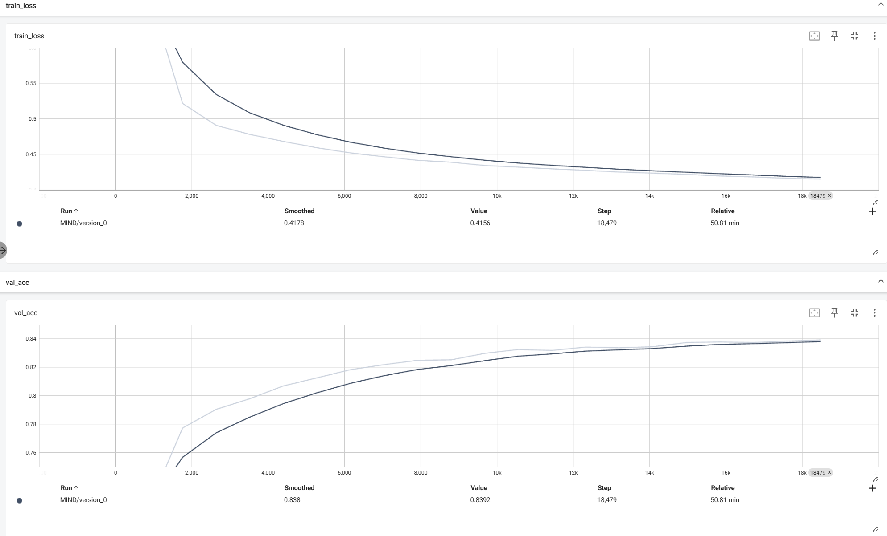

# 📌 MIND: Multi-Interest Network with Dynamic Routing for Recommendation

## 🔍 Introduction
This repository implements **MIND**, a powerful recommendation model originally proposed by Tmall for capturing **diverse user interests** via **multiple vectors** and dynamic routing. Built with **PyTorch Lightning**, the model is trained to learn multi-interest user embeddings and perform matching with items using label-aware attention.

---

## 📦 Features

-  Multi-interest extractor layer using dynamic routing (capsule-style)
-  Label-aware attention mechanism to compute user-item relevance
-  Embedding and MLP layers with ReLU activation
-  Loss: `BCELoss`
-  Evaluation metrics: Recall@K, Validation Loss
-  Modular design using PyTorch Lightning

---

## 📁 Dataset

This implementation works with **MovieLens 1M** dataset.

---

## 🛠️ Requirements

```bash
pip install pytorch_lightning
```
---

## 🚀 Training

```bash
python MIND1.py
```

---

## 📈 Performance
| Metric  | Value  |
|---------|--------|
| Training loss | 0.416 |
| Val acc | 83.92 % |
| HR@50 | 0.104 |




